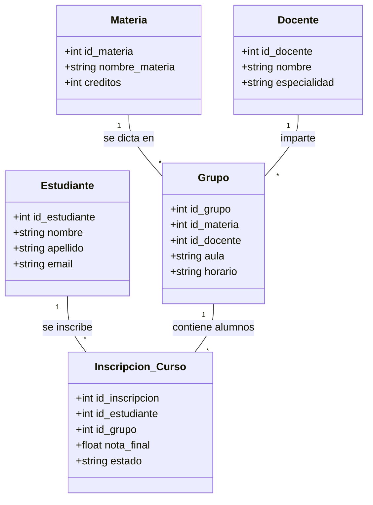

# PRÁCTICA ACADÉMICA - SISTEMA DE GESTIÓN UNIAJC (MVC + DB)

## Objetivo
Replicar el ecosistema académico propuesto en el diagrama Mermaid, siguiendo los estándares de arquitectura en capas (Entidad, DAO, Service, Controlador, Vista).

## Nombres:
### -John Steban Morales Ceron
### -Carlos Alberto Obando Torrente

## Grupo: 412

## Diagrama del Ecosistema
